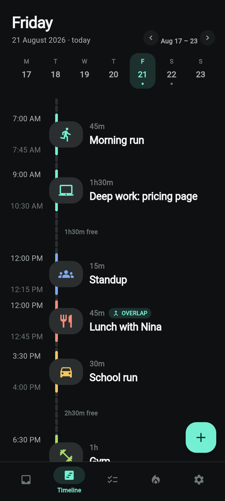
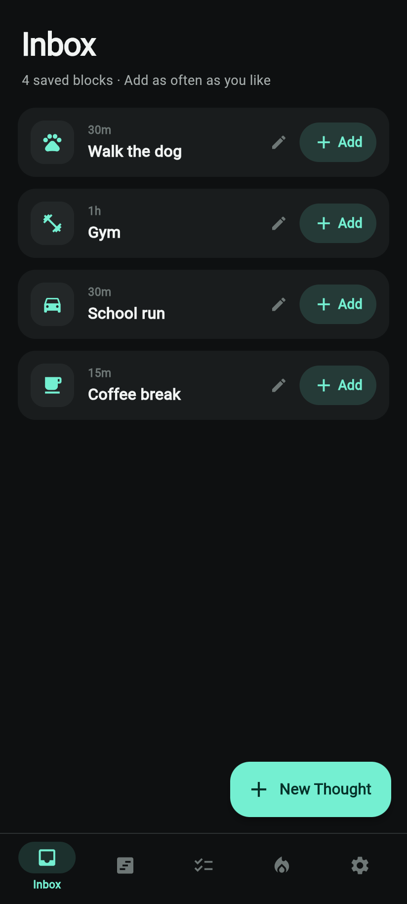
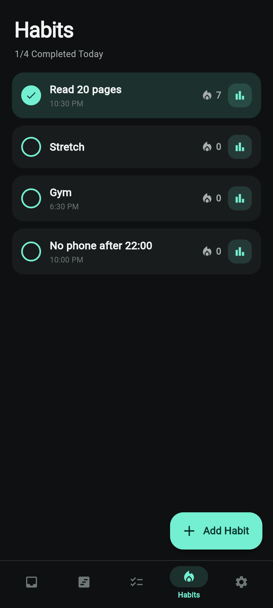

# Timebox

A day planner for Android. You lay the day out in blocks on a timeline, keep a
list of tasks, and tick off habits to build streaks.

Everything stays on the phone. No account, no sign-up, no cloud, no analytics.

<p align="center">
  
  
  
</p>

## Get the app

**[Download the latest APK →](https://github.com/lukabraske37/Timebox/releases/latest)**

Open that link on your phone, tap `app-release.apk` under **Assets**, then open
the file once it downloads. Android will ask you to allow installing apps from
this source — say yes, and that's it.

Allow notifications the first time you open it, otherwise reminders for blocks
and habits won't come through.

## What it does

**Timeline.** The day is a vertical track and each block sits where it actually
falls. An empty three-hour afternoon looks like three hours, so you can see the
gaps rather than count them. Hold a block to pick it up and drag it to a new
time; tap it to nudge the start or the length in small steps.

Blocks stay on the day you put them on, and a block set to repeat comes back
daily, weekly or monthly. Change or drop one of those days and the rest of the
series carries on untouched.

**Inbox.** The things you plan over and over — gym, walk the dog, school run —
live here with their usual length. One tap drops any of them onto the day.

**Tasks.** A plain list for the things that just need doing, each with an
optional reminder.

**Habits.** Tick them off daily and watch the streak grow. Charts show the last
five weeks up to a full year.

**Reminders.** Alerts when a block starts or ends, or 15 minutes / half an hour /
an hour before. Tasks and habits get their own, plus one optional summary of the
day.

**Make it yours.** Six themes, five accent colours, 12- or 24-hour clock, and a
fingerprint lock if you want one.

**Your data is yours.** Export everything to a single file you keep, and load it
back whenever you like.

## Build it yourself

You need [Flutter](https://docs.flutter.dev/get-started/install).

```bash
flutter create --platforms=android --org com.timebox --project-name timebox .
cp android_overrides/AndroidManifest.xml android/app/src/main/AndroidManifest.xml
flutter pub get
flutter run
```

The `android/` folder is generated rather than committed, which is why the first
command is there. Every push builds a fresh APK and publishes it to
[Releases](https://github.com/lukabraske37/Timebox/releases).

Built with Flutter.
